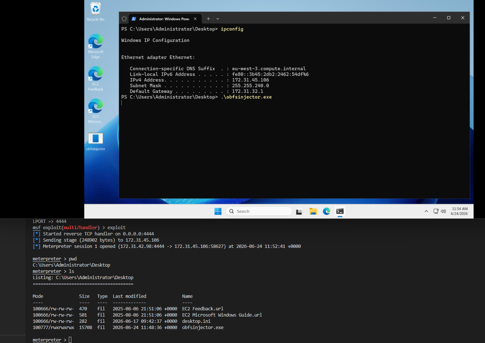

# 🚀 Advanced Payload Injector with EDR/AV/Sandbox Evasion

## 🔥 Overview
This project implements a **stealthy Payload injector** for **Windows 10 and 11** with advanced evasion techniques. It includes mechanisms to **bypass EDR, AV, and sandbox detections** while using direct syscalls, manual API resolution, PEB walk, and obfuscation to reduce detection rates. The injector creates a suspended process, injects an embedded payload (built with msfvenom), and executes it in a stealthy manner. 

> NEW: Rather than loading and executing a DLL already present on disk, the loader now has its own obfuscated payload 👌The old dll injector is always available on the [dllInjector](https://github.com/Neyrian/DLL-Injector/tree/dllInjector) branch. Tho, it's not optimized and has a lot of flaws ^^

---

## 📌 **Features**

✅ **Stealthy Injection:** Creates a suspended process and injects a payload without using common Windows API calls.

✅ **Embeded payload:** Upon compilation, the payload is dynamically embedded into the binary.

✅ **EDR/AV/Sandbox Evasion:** (Optional) Implements multiple checks to detect sandbox environments, VM detection, and EDR hooks.

✅ **Direct Syscalls:** Bypass API hooks. (hardcoded SSN. Improvement: use Hell's Gate & SysWhispers)

✅ **Avoid calling function from module:** Uses `PEB walk` to retrieve functions in modules without loading them.

✅ **NEW Obfuscation:** Rather than plain string Base64 encoding, suspicious artifacts are obfuscated after the binary is build. Thanks to [4g3nt47's Obfuscator](https://github.com/4g3nt47/Obfuscator.git).

✅ **NEW Removing dtoa Dependencies (CRT-Free Formatting)** maintain a purely native, dependency-free binary by avoiding the standard C formatting engine: No Floating-Point Math, Native Windows APIs Only.

✅ **NEW Automated OpSec & Heuristics Testing:** includes a custom (AI generated)static-analysis engine (opsec_analyzer.py) designed to evaluate compiled payloads against common Endpoint Detection and Response (EDR) and Antivirus (AV) heuristics. *Just for fun*

✅ **Decoy Execution:** The injector executes a decoy function to mimic legitimate software behavior.

---

## 🚀 **Usage**
### **1️⃣ Compilation**
```info
Requirements:
  - gcc-mingw-w64-x86-64-win32
  - nasm
  - gcc
  - make
  - python3
  - (optional) radare2
```
**Note**
> - It's recommanded to disable debugging (```#define DEBUG false``` in ```evasion.h```.)
> - You can disable all the security checks: ```#define EVADE false``` in ```evasion.h```

Use **makefile** or compile it your ways (don't forget to use the obfuscator 😊 )

The makefile will:
```
1 - Compile the dependencies
2 - Compile the obfuscator
3 - Build the payload (you can modify it directly from the makefile)
4 - Run the payloadObfuscator on the generated payload.h
5 - Compile the payloadinjector.c into injector.exe
6 - Modify the PE section
7 - Run the obfuscator, this will generate obfsinjector.exe
8 - Fix the checksum cause we messed with the PE :)
9 - (Optional) run a check script for fun
```

### **2️⃣ Running the Injector**
On windows
```powershell
obfsinjector.exe
```
**Note**: 
> Use the obfsinjector executable. Otherwise, the build binary (injector.exe) won't work since the strings won't be obfuscated.

Example of msfvenom reverse shell exploitation on Windows Server 2025 Datacenter 24H2 26100.32995:


---
### **Automated OpSec & Heuristics Testing**
```bash
make tests
```
Just for fun

---

## 🐍 **EDR, AV, and Sandbox Evasion**
### ✅ **EDR Detection (`detector.c`)**
- Scans `C:\Windows\System32\drivers\` for known **EDR & AV drivers** (Carbon Black, CrowdStrike, SentinelOne, etc.).
- If found, decoy is executed instead of the injection.

### ✅ **Anti-Sandbox Techniques**
- **Detects Virtual Machine Artifacts**:
  - Checks for **VMware**, **VirtualBox**, and **Hyper-V files**.
- **Detects Sleep Patching**:
  - Measures the **execution time** of `Sleep(10000)`.
  - If altered, execution is stopped.
- **Detects Filename Hash Matching**:
  - Checks if the **binary filename matches its MD5 hash** (common in packed malware).
- **Detects Sandbox DLLs**:
  - Checks for the presence of sandbox's DLLs and checks if some real dll exists
### ✅ **Anti-Debugger Techniques**
- **Detect if NtGlobalFlag is present in PEB.**
- **Detect debugger flags in HEAP**

### **VT and sandbox analysis**
I am still working on the stealh:
- Using a simple msfvenom's msgbox payload:
  - 0/68 on [VirusTotal](https://www.virustotal.com/gui/file/f011ce53f52033c0ba4c2376e267769f1e036253a78da8b36bb0b770bfc2b9ce). AI insight: The sample is classified as MALICIOUS due to its extensive use of evasion and anti-analysis techniques. It dynamically resolves APIs by walking the Process Environment Block (PEB) Ldr list and decrypting obfuscated strings. It implements multiple anti-debugging and anti-sandbox checks, including NtGlobalFlag inspection, heap flag validation, timing checks via Sleep, and blacklisted driver/process checks. Additionally, the binary utilizes direct system calls (syscalls) to bypass security monitoring and EDR hooks.
  - 35/100 Suspicious on [Hybrid Analysis Sandbox](https://hybrid-analysis.com/sample/f011ce53f52033c0ba4c2376e267769f1e036253a78da8b36bb0b770bfc2b9ce)
  - 64/100 malicious on [Zenbox sandbox](https://vtbehaviour.commondatastorage.googleapis.com/f011ce53f52033c0ba4c2376e267769f1e036253a78da8b36bb0b770bfc2b9ce_Zenbox.html?GoogleAccessId=758681729565-rc7fgq07icj8c9dm2gi34a4cckv235v1@developer.gserviceaccount.com&Expires=1782302482&Signature=XOFa0dXEP16a%2BOiFdN%2FtsGdRsNz6JsG0RaqvqXxTM69mGvxc50qYa2R5L3TuYWwbSA4YrS8a8V%2ByuIn4Hr0ZS%2B7z%2BZWjeQPs2HVymYMcrtFjYDAjZofDuGnbUYwYsFDfptIvwtUUQicA6t2mbFmTIsuWn%2B7%2FAsIaqkhGWkIbBAWkeIvABIAe%2FOkj%2FfmnHDdLO6%2B9un6t70uKIbNH%2B%2B3fb1nI4O3qd00E%2FOoL0oTShqwRUvRDCd1IixOmiycrti1ne9X84lk3HvaKaMXh48G7MkF4lMjzLKayRY89bnOldQySsE92NRuQXgIwG9o3doojaXwtc29AEmE5v1it%2BTyWcA%3D%3D&response-content-type=text%2Fhtml;#overview)
- Using a simple msfvenom's windows/x64/meterpreter/reverse_tcp payload
  - 0/68 on [VirusTotal](https://www.virustotal.com/gui/file/8c4dfacf40264170935502474402d5a54c87cf10ab3c3bb07ac7f089cf31a2bf). AI Insight: The sample is a malicious loader/crypter designed to evade detection and execute a payload. It dynamically resolves APIs by walking the PEB LDR list and decrypting string references using a custom XOR-based routine (sub_140002480). It implements extensive anti-analysis and anti-debugging checks (sub_140001b80), including NtGlobalFlag and ProcessHeap checks, timing-based sandbox detection (sub_1400017e0), blacklisted process/module checks (sub_140001860, sub_140001650), and scanning for security-related drivers (sub_140001360). If debugging or analysis is detected, it executes a decoy function (sub_140001c00) that prints dummy calculations. Otherwise, it proceeds to execute its payload using direct system calls (syscalls) to bypass EDR/AV monitoring hooks.
  - 35/100 Suspicious threat on [Hybrid Analysis Sandbox](https://hybrid-analysis.com/sample/8c4dfacf40264170935502474402d5a54c87cf10ab3c3bb07ac7f089cf31a2bf)
---

## 📝 **Project Structure**
```
📂 Project Folder
│── payloadinjector.c     # Main Payload injector
│── detector.c            # EDR/AV/Sandbox detection
│── evasion.c             # Evasion functions (syscalls, b64decode...) and decoy
│── detector.h            # Header file for detection functions
│── evasion.h             # Header file for evasion functions and decoy
│── syscalls.asm          # Direct Syscalls Functions
|── makefile              # easy to compile
│── README.md             # This documentation
│── 📂 obfs_obfuscator        # Contains the obfuscators c files
    │── obfuscator.c          # Main program used to obfuscate the build binary
    │── binary_obfuscator.c   # Contains the obfuscator's functions
    │── binary_obfuscator.h   # Contains the obfuscator's definition
    │── payloadObfuscator.c   # Contains the obfuscator's payoad functions
│── 📂 tests                  # Contains the Automated OpSec & Heuristics Testing
    │── opsec_analyzer.py     

```
---
## Modules Breakdown
### **Main Payload Injector: payloadinjector.c**
- Creates a **suspended** process (`SearchProtocolHost.exe`).
- Uses **direct syscalls** to allocate memory, write the payload and executes the payload stealthily.

### **EDR/AV/Sandbox Detection: detector.c & detector.h**
- Detects **common AV/EDR drivers** in `C:\Windows\System32\drivers`.
- Checks for **sandbox-specific DLLs** like `cuckoomon.dll`, `VBox*.dll`, etc.
- Implements **sleep patching** to evade automated sandboxes.

### **Evasion Functions & Decoy Execution: evasion.c & evasion.h**
- Implements **Base64 encoding & decoding** to hide payload and function names.
- **Legitimate Decoy Execution**: The injector executes a CPU-intensive function to simulate legitimate software behavior.
- Use PEB walk to retrieve function in modules without API.

### **Direct Syscalls: syscalls.asm**
- Implements **NtAllocateVirtualMemory, NtWriteVirtualMemory, NtProtectVirtualMemory, NtQueryDirectoryFile** using direct syscalls.

### **Obfuscator**
- Not my work, please ref to [Obfuscator](https://github.com/4g3nt47/Obfuscator.git).

> TL;DR: The Obfuscator is compiled and the built binary is passed to the obfuscator. Then each string in the binary that start with a unique string ([OBFS_ENC]) is then encoded one byte at a time by XORing it with a key that is continously adjusted.
---

## **Test**

- [x] Windows 10 (22H2)
- [x] Windows 11 (11 24H2)
- [x] Windows Server 2025 (24H2)

---

## ⚠️ **Legal Disclaimer**
> **This tool is for educational and research purposes only.**  
> Do not use it for malicious activities. The author is not responsible for any misuse.

---

## 📬 **Contributing**
Feel free to **submit issues or pull requests** to improve the project.  

---

## 📜 **References**
- 🔗 **MITRE ATT&CK Framework**: [T1202 - Indirect Command Execution](https://attack.mitre.org/techniques/T1202/)  
- 🔗 **AV & EDR Detection**: [Exe_Who GitHub](https://github.com/Nariod/exe_who)
- 🔗 **Binary Obfuscation**: [Obfuscator](https://github.com/4g3nt47/Obfuscator.git)
---

🚀 **Happy Hacking!**

